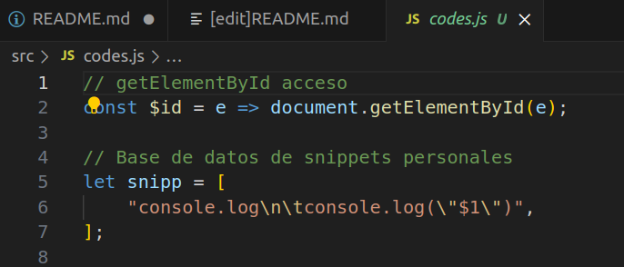
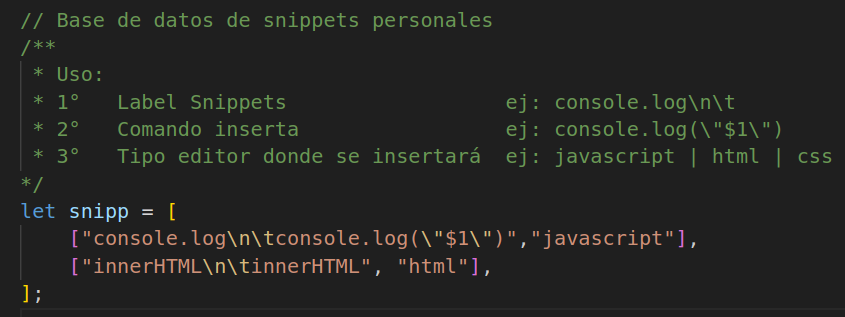
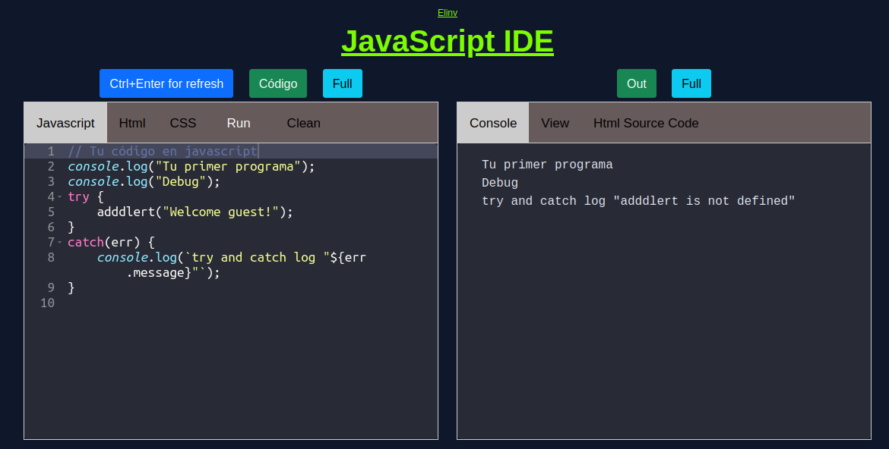
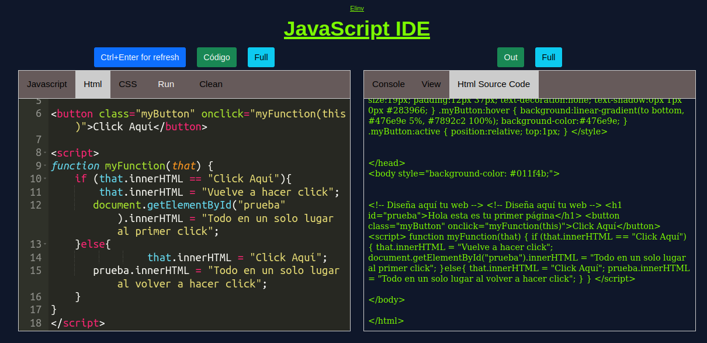
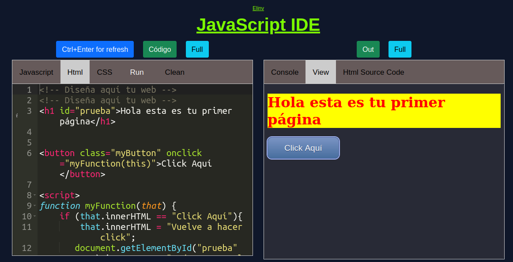
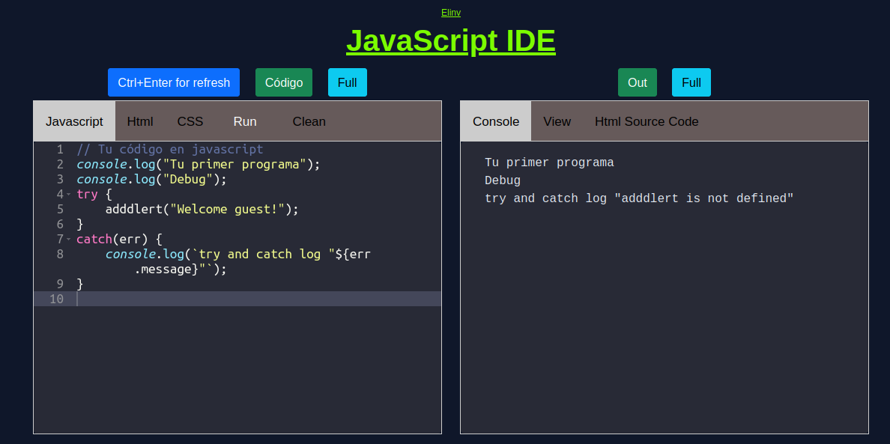

# Editor Wwysiwyg elinv with Ace---

> ## 📝 Con Ace Editor multiprograma,
> 
> este repositorio pretende hacer fácil
> el desarrollo web
> a través de la escritura
> de código en Html, Css y Javascript.
> Permanentemente lo iremos mejorando.

## [Editor elinv with Ace online](https://elinv.github.io/jsedit/index.html)

* [x] Agrega tus propios códigos de autocompletado, implementando añadidos en el array -snipp- en => codes.js



* [x] Si descargan el respositorio funciona perfectamente off line a través de un servidor como puede ser Live Server o el Servidor php a través de la linea de comando bash
* [x] ➡️ php -S localhost:8000
* [x] Agregado posibilidad de insertar propios snippets HTML, CSS y JS, a través del archivo "/src/codes.js"
* [x] En el editor HTML, luego de modificado el código, al presionar "enter" or "Ctrl + Enter" o "Ctrl + NumpadEnter", se updata vista "html css y javascript" en el tab "VIEW"
* [x] En el Tab "HTML SOURCE CODE", obtienen la totalidad del código, por ustedes diseñado.
* [x] Se ha posibilitado el poner los tab a pantalla semi completa y recuperar la vista inicial.

## Imágenes que dicen todo!

> 












---

* Cualquier duda que tengan la dirigen a [elinv.elinv@gmail.com](mailto:elinv.elinv@gmail.com).
* 🛠️ Errores, sugerencias, ideas, envialas a nuestro mail: [elinv.elinv@gmail.com](mailto:elinv.elinv@gmail.com)

---

## Web Elinv.

<a href="https://elinv.musica.ar" href="_blank">
   Web Elinv
</a>

## - Ver info de Elinv en Microsoft Bing Search:

<a href="https://www.bing.com/search?q=elinv" href="_blank">
   Enlace a la info de Elinv  -> en Microsoft Bing Search
</a>

## - Ver info de Elinv en Google Search:

<a href="https://www.google.com.ar/search?q=elinv" href="_blank">
   Enlace a la info de Elinv  -> en Google Search
</a>

## - Ver canciones de Elinv:

<a href="https://www.reverbnation.com/elinv" href="_blank">
   Enlace a las canciones de Elinv  -> en Reverbnation
</a>

<a href="https://www.n1m.com/elinv/" href="_blank">
   Enlace a la web de Elinv  -> en N1M
</a>

A todos los jóvenes,
a los internautas,
a los programadores,
que crean que pueden usar ese código
para trabajar,
y ayudarse en su vida
o la de algún familiar.

Háganlo,
úsen toda las ideas de Elinv
y Dios les proveerá
un presente y futuro maravilloso.

```
- El conocimiento es de todos!
```

Úsenlo libremente,
es de libre dominio,
y lleven todo el bien
a todos sus hermanos,

especialmente
a aquellos
menos favorecidos.

No les demuestren
vuestra posición,
solo déjenle ver
el amor de Dios Padre.

---

Qué hermoso es tenerlos
a todos,
ayudando.

```

```

Dios los bendiga!

Ha sido un placer vivir!
Conocerlos,
conocer esta generación!
Ver la nada tecnológica,
y ver la media tecnológica,
porque lo que ha de venir,
no es ni comparado
con lo existente!

Aun no se nos da!
porque el alma no esta dispuesta!

```
## Cuando esto suceda,
ese conocimiento se nos dará!
Elinv
```

